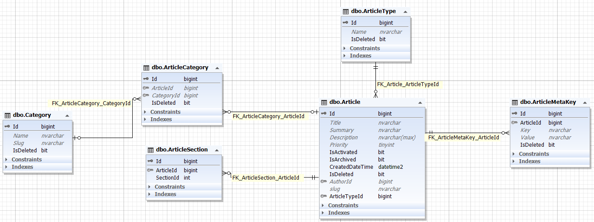

    
    

##### بسمه تعالی

#### سند تحلیل فرایند مقاله

#### ویرایش: 04/11/1400 – تدوین: 04/11/1400 – تهیه کننده: سید علی فخری

****

**فهرست**

[تعاریف و اصطلاحات](#_Toc93951617)

[تشریح و تحلیل فرایند مقاله](#_Toc93951618)

[ دیاگرام موجودیت  (ERD)](#_Toc93951620)

****

 
 

> **تعاریف و اصطلاحات**

> *برای مطالعه تعاریف و اصطلاحات [تعاریف](../common/CommonStructure.md) را مطالعه فرمایید*

****

> **تشریح و تحلیل فرایند**

قسمتی از صفحات سامانه شامل مقاله ها می شوند. این مقاله ها در موجودیتی به نام Article ذخیره سازی می شوند. همچنین خود صفخات نیز در همین جدول ذخیره سازی می شوند و تفاوت آن ها در نوع آن ها در جدول است.

برای استفاده از سرویس های مقاله ما از id آن مقاله استفاده می کنیم درحالی که برای کار با صفحات از slug که کلمه شاخص برای دریافت اطلاعات می باشد.

با این حال برای عملیات CRUD از سمت داشبورد، برای هردو از ID استفاده می شود.

برای اینکه مشخص شود این مقالات در کدام قسمت های صفحات قرار گیرند، موجودیتی به نام ArticleSection تعریف شده و آیدی مقاله و قسمت مورد نظر در آن جا قرار دارد.

هر مقاله دارای تصویر شاخصی می باشد که در جدول ArticleMetaKey قرار گرفته است.

هر مقاله ممکن است در دسته بندی های متفاوت قرار بگیرد بنابر این موجودیت Category برای اداره این مسئله تعریف شده که رابطه چند به چند با مقالات دارد.

> *برای مطالعه پیاده سازی مقاله [پیاده سازی مقاله](./ArticleBussiness.md) را مطالعه فرمایید*

> *برای مطالعه پیاده سازی صفحات [پیاده سازی صفحه](./PageBussiness.md) را مطالعه فرمایید*

 

 

جدول Article : 

**Title** : عنوان

**Summery** : خلاصه

**Description** : متن که بصورت HTML می باشد.

**Priority** : اولویت

**IsActivated** : فعال بودن

**IsArchieved** : آرشیو بودن

**AuthorId** : نویسنده

**Slug** : کلمه شاخص

**ArticleTypeId** : نوع مقاله

 

جدول ArticleMetaKey : 

**Key** : عنوان تصویر

**Value** : آدرس تصویر

 

جدول Category : 

**Name** : نام دسته بندی

**Slug** : کلمه شاخص دسته بندی

 

