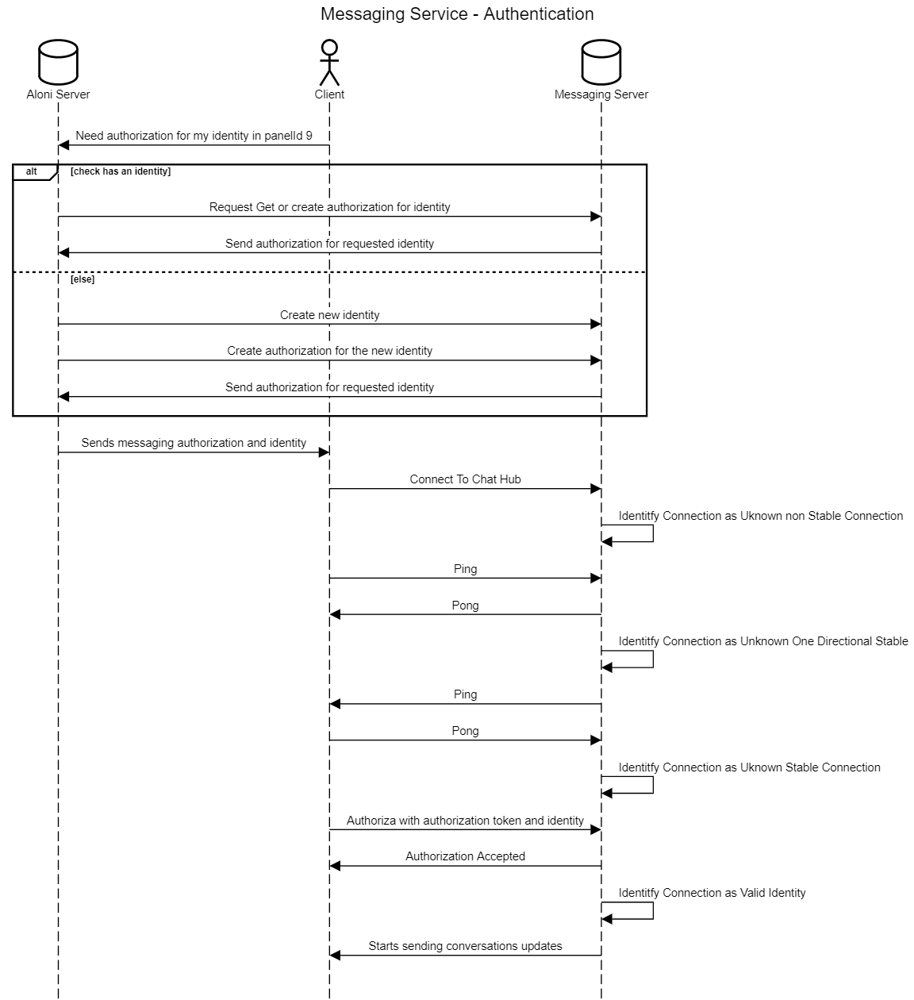

<div dir="rtl" align="right">

# فرایند احراز هویت


_دیاگرام پروسه ورود یک کاربر به سامانه از سیستم خارجی_

> این یک دیاگرام نمونه می باشد که تصویر آن در مستندات درج شده است

**توضیحات تکمیلی در مورد رویه اهراز هویت**:
توضیحات توضیات توضیحات توصیحات توضیحات توضیحات
توضیحات توضیات توضیحات توصیحات توضیحات توضیحات
توضیحات توضیات توضیحات توصیحات توضیحات توضیحات توضیحات.
توضیحات توضیات توضیحات توصیحات توضیحات توضیحات
توضیحات توضیات توضیحات توصیحات توضیحات توضیحات

### نمونه پیاده سازی با Dart و Rx

<div dir="ltr" align="left">

```dart
Observable<bool> authenticate() => //
    // start ping pong
    Observable.zip3(
      client.$pong.take(1),
      client.$ping.take(1),
      Observable.fromFuture(client.ping$()),
      (pong, pingC, ping) => connectionStateController
          .add(ConnectionState.OneWayStableConnection),
    )
        // sent a ping and got a pong
        // start pong ping
        .exhaustMap(
          (_) => Observable.fromFuture(client.pong$()),
        )
        .map(
          (_) =>
              connectionStateController.add(ConnectionState.StableConnection),
        )
        // got a ping and sent a pong
        // send authorization
        .exhaustMap(
          (_) => Observable.zip2(
              client.$authorizationResult,
              Observable.fromFuture(
                client.authorize$(
                  token: client.userToken,
                  identity: client.userIdentity,
                ),
              ), (result, _) {
            if (result.isOk) {
              connectionStateController
                  .add(ConnectionState.AuthorizedStableConnection);
            } else {
              connectionStateController
                  .add(ConnectionState.UnauthorizedStableConnection);
            }
            return result.isOk;
          }),
        );
```

</div>

> توضیحات تکمیلی