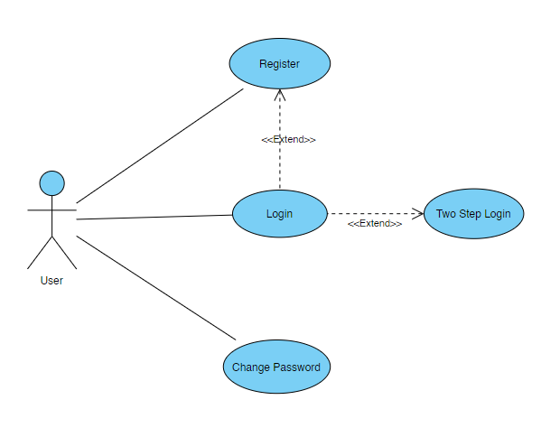
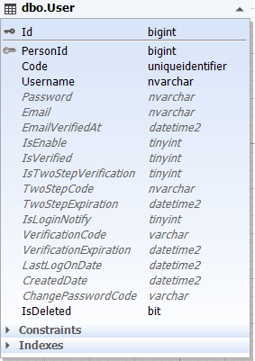
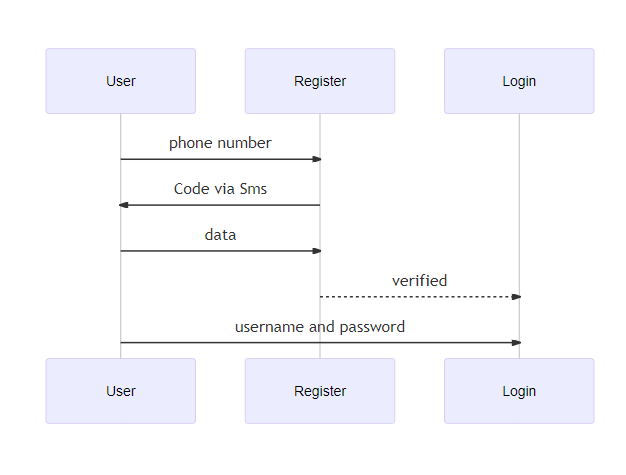

    
    

#### بسمه تعالی

### سند تحلیل فرایند احراز هویت

### ویرایش: 04/11/1400 – تدوین: 04/11/1400 – تهیه کننده: سید علی فخری

****

### **فهرست**

[تعاریف و اصطلاحات](#_Toc93951617)

[تشریح و تحلیل فرایند احراز هویت  ](#_Toc93951618)

[ دیاگرام کاربرد (UseCase)](#_Toc93951619)

[ دیاگرام موجودیت  (ERD)](#_Toc93951620)

[ دیاگرام ترتیب  (Sequence)](#_Toc93951621)

****

 
 

> ## **تعاریف و اصطلاحات**

> *برای مطالعه تعاریف و اصطلاحات [تعاریف](../common/CommonStructure.md) را مطالعه فرمایید*

****

>## **تشریح و تحلیل فرایند**

فرایند احراز هویت از ثبت نام کاربر شروع می شود. کاربر با ثبت نام در سامانه به عنوان عضوی از سامانه شناخته شده و می تواند بوسیله نام کاربری و رمز عبور در هر زمانی وارد سیستم شود.

همچنین کاربران می توانند درصورت فراموشی رمز عبور خود آن را در صفحه اصلی هم ویرایش کنند.

همچنین امکان ورود دو مرحله ای بصورت ارسال کد از طریق پیامک نیز وجود دارد.

> *برای مطالعه نحوه ثبت نام [تحلیل ثبت نام](../user-person/Registration.md) را مشاهده فرمایید*

> *برای مطالعه نحوه ورود [تحلیل ورود](./Login.md) را مشاهده فرمایید*

> *برای مطالعه نحوه تغییر رمز عبور [تحلیل رمز عبور](./ChangePassword.md) را مشاهده فرمایید*

> *برای مطالعه ورود دو مرحله ای [تحلیل ورود دو مرحله ای](./ChangePassword.md) را مشاهده فرمایید*

 

****

 ## **نمودار کاربرد ( use case diagram )**

نمودار کاربرد فرایند قبت نام به شکل زیر می باشد:

****

**در زیر می توانید دیاگرام موجودیت ها و کلاس های این فرایند را مشاهده نمایید**

 

> *برای مطالعه اجزاء این موجودیت [جدول User](../user-person/Registration.md) را مشاهده فرمایید*

 

****

>## **نمودار ترتیب (sequence diagram)**

 

نمودار ترتیب احراز هویت

 

