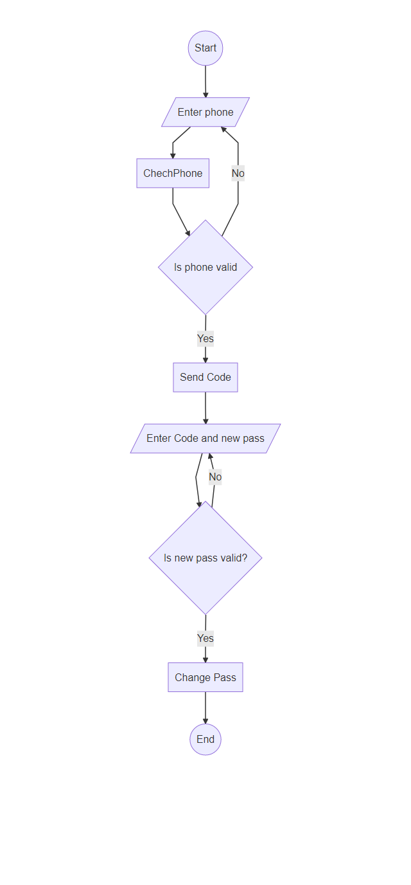

برای تغییر رمز عبور، کاربر باید شماره تلفن خود را وارد کند سپس سیستم چک میکند که همچین شماره ای موجود باشد. سپس یک کد گیامک می شود که کاربر باید آن را به همراه رمز عبور جدید و تکرار آن وارد کند. نهایتا سیستم آن کد را اعتبار سنجی میکند و رمز عبور و تکرار آن را نیز بررسی میکند و رمز جدید را بصورت Hash در جدول User ویرایش می کند.

> *برای مطالعه پیاده سازی تغییر رمز عبور [پیاده سازی تغییر رمز عبور](./ChangePasswordBussiness.md) را مشاهده فرمایید*

 

