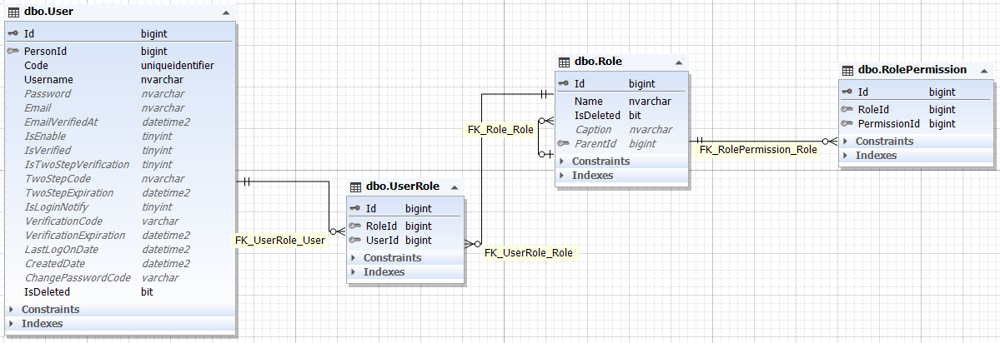

    
    

#### بسمه تعالی

### سند تحلیل فرایند سطح دسترسی

### ویرایش: 04/11/1400 – تدوین: 04/11/1400 – تهیه کننده: سید علی فخری

****

### **فهرست**

[تعاریف و اصطلاحات](#_Toc93951617)

[تشریح و تحلیل فرایند احراز هویت  ](#_Toc93951618)

[ دیاگرام موجودیت  (ERD)](#_Toc93951620)

****

 
 

> ## **تعاریف و اصطلاحات**

> *برای مطالعه تعاریف و اصطلاحات [تعاریف](../common/CommonStructure.md) را مطالعه فرمایید*

****

>## **تشریح و تحلیل فرایند**

سطح دسترسی در این سیستم به ازای نقش هر کاربر یا User داده می شود. یعنی شخصی که دارای حساب کاربری در سامانه باشد.
در حالت عادی یک کاربر می تواند چندین نقش داشته باشد و یک نقش نیز می تواند به چند کاربر اختصاص یابد. بنابر این یک رابطه چند به چند بین آن ها برقرار است و این رابطه توسط یک موجودیت سوم به نام نقش کاربری اداره می شود. با اینکه در این سیستم نقش و کاربری به شیوه مذکور طراحی شده اما پیاده سازی آن متفاوت است. یعنی در سامانه ما در حال حاضر هر کاربر فقط می تواند یک نقش داشته باشد. با این حال ما بصورت چند به چند طراحی کرده ایم برای توسعه در آینده.

برای تعیین سطح دسترسی هر نقش نیز، برای عملیات های متفاوت مجوز های گوناگون در نظر گرفته ایم به این صورت که هر مقش میتواند چند مجوز در اختیار داشته باشد و بر اساس آن مجوز ها به عملیات ها دسترسی دارد.

> *برای مطالعه نقش و کاربری [تحلیل نقش و کاربری](.UserRole.md) را مشاهده فرمایید*

> *برای مطالعه مجوز ها [تحلیل مجوز نقش](./RolePermission.md) را مشاهده فرمایید*

 

****

**در زیر می توانید دیاگرام موجودیت ها و کلاس های این فرایند را مشاهده نمایید**

 

 

