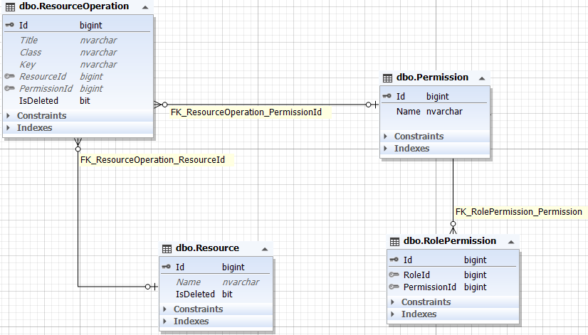

هر نقش دارای چندین مجوز است. این مجوز ها در واقع به منابع موجود در سیستم ارتباط پیدا می کنند. و هر مجوز می تواند چند منبع را پوشش دهد و برعکس. بنابر این بین موجودیت مجوز و منبع نیز رابطه چند به چند برقرار است. منظور از منابع همان عملیات های سیستم هستند که در سمت فرانت بصورت دکمه نمایش داده می شوند. به این صورت که بررسی می شود کاربر استفاده کننده از سیستم نسبت به نقش خود به کدام مجوز ها دسترسی دارد و منابع آن دسترسی برای استفاده دریافت شده و به کاربر نمایش داده می شوند. تمام این فرایند با استفاده از رفت و برگشت های میان فرانت و بک انجام می گیرد.

 

دیاگرام  مجوز و منابع و جزئیات آن ها به شرح زیر است:

موجودیت Permission:

**Name** : نام مجوز

 

موجودیت Resource:

**Name** : نام منبع

 

موجودیت ResourceOperation:

**Title** : نام عملیات

**Class** : تعیین کننده نوع آیکون برای نمایش در فرانت

**Key** : نوع عملیات آیکون

