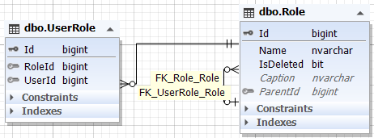
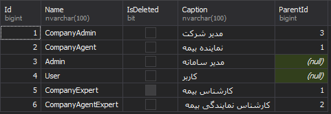

همان طور که گفته شد در این سامانه هر کاربر فقط یک نقش دارد اما برای راحتی در توسعه آینده، طراحی آن بصورت چند به چند می باشد.

اما نکته ای قابل توجه وجود دارد; ممکن است نقش هایی وجود داشته باشند که زیر مجموعه نقش دیگری باشند. مانند نقش های مربوط به شرکت که کارشناس شرکت زیر مجموعه مدیر شرکت است. یا کارشناس نمایندگی زیر مجموعه نماینده شرکت است و نماینده شرکت نیز زیرمجموعه مدیر شرکت. بنابر این باید جدول نقش با خود نیز یک رابطه داشته باشد.

جداول آن بصورت زیر می باشد:

 

مشخص است که جدول UserRole رابط می باشئ و صرفا آیدی های دو جدول دیگر را در خود جای داده. بنابر این به توضیح فیلد های جدول Role می پردازیم:

**Name** : نام لاتین نقش

**Caption** : نام فارسی نقش

**ParentId** : کلید ارتباط این جدول با خود.

 

داده های فعلی این جدول بصورت زیر است:

 

> *برای مطالعه پیاده سازی نقش [پیاده سازی نقش](.UserRoleBussiness.md) را مشاهده فرمایید*

