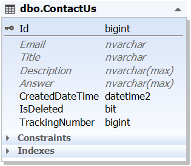
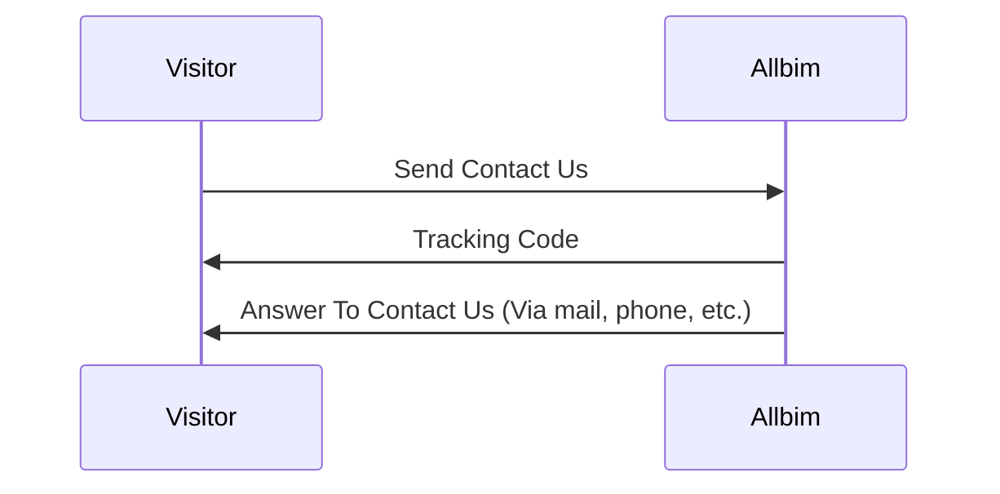

# فرایند تماس با ما
هدف این فرایند، برقراری ارتباط مخاطب با سامانه بدون احراز هویت می باشد. 

## دیاگرام ER

## دیاگرام توالی

نکته ای که حائز اهمیت است، به علت عدم احراز هویت مخاطب، جواب باید بصورت ایمیل، پیامک یا بصورت تلفنی به مخاطب ارائه شود.