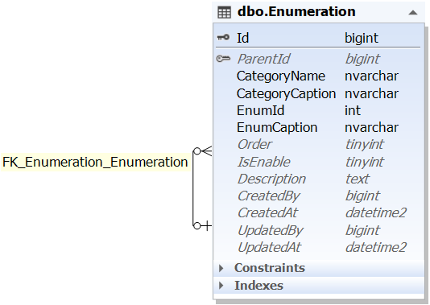
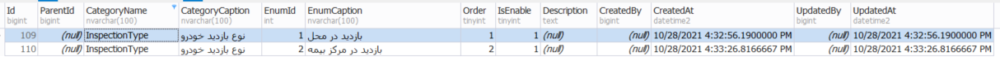

# Enumeration
جدول Enumeration جهت نگهداری رکوردهایی می باشد که بصورت enum در طول برنامه استفاده می شوند. مزیت این روش این است که می توان بر روی جدول مدیریت کرد و به راحتی تغییرات انجام داد. در صورتی که در کد نیاز به build دوباره داریم.

## دیاگرام ER

در این جدول، داده های enum با دو فیلد CateoryName و CategoryCaption گروه بندی می شوند و شناسه هر enum در اصل فیلد EnumId و متن enum برابر EnumCaption می باشد.

نمونه داده های جدول:

البته بعضی داده های enum که در طول زمان غیرقابل تغییر هستند همچنان در پروژه بصورت استاتیک و enum تعریف و استفاده می شوند.