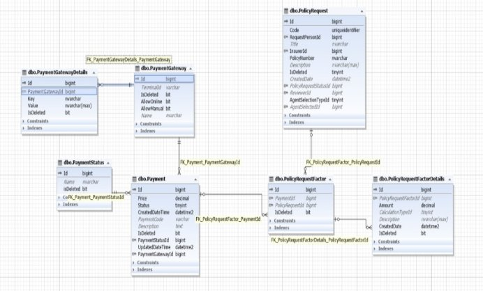



    
    

##### بسمه تعالی

#### سند تحلیل فرایند پرداخت

#### ویرایش: 04/11/1400 – تدوین: 04/11/1400 – تهیه ‏کننده: سید علی فخری

****

**فهرست**

[ تعاریف و اصطلاحات](#_Toc93951617)

[تحلیل فرایند پرداخت](#_Toc93951618)

[ دیاگرام کاربرد (UseCase)](#_Toc93951619)

[ دیاگرام موجودیت  (ERD)](#_Toc93951620)

[ شرایط کار](#_Toc93951621)

****

>**تعاریف و اصطلاحات**

**کاربر عادی :**

کاربرانی که برای خرید بیمه از سیستم استفاده میکنند و دسترسی آن ها بسیار محدود است و نام نقش آن ها در سیستم user است

**مدیریت سیستم :**

 کاربر یا کاربرانی که دسترسی کامل به تمام قسمت های سیستم و تمام افراد یا اعضای سیستم دارند و با نام admin شناخته می شوند.

**شرکت : **

اشاره به تمام نقش های مرتبط به شرکت دارد

**مدیریت شرکت :**

 کاربر یا کاربرانی که با تعریف یک شرکت در سیستم وارد سیستم شده اند و به تمام قسمت ها و اعضایی که به آن شرکت مربوط باشد دسترسی کامل دارند.

**آدرس سرویس هایی که شامل mine می شوند: **

سرویس های مختص همان شرکت است.

**آدرس هایی که بعد از نام کنترلر {code} را شامل می شوند: **

معمولا این آدرس ها توسط مدیریت سیستم استفاده می شوند و در سایر موارد توضیحات شرح داده خواهد شد.

کلید هایی که در آدرس ها در { } قرار میگیرند مقادیری هستند که از طریق url به سمت سرور ارسال میگردند.

****

> **تحلیل فرایند**

پس از درج درخواست بیمه نوبت به فرایند پرداخت می‌رسد. قبل از پرداخت ابتدا باید فاکتور و جزئیات آن به کاربر نمایش داده و سپس با زدن دکمه پرداخت، کاربر به صفحه درگاهی که انتخاب کرده وارد می شود و پرداخت را انجام می دهد. توضیحات تکمیلی و تحلیلی این فرایند به شرح ذیل است:

جدولی به نام PaymentGateway که در آن اطلاعات درگاه ها ذخیره سازی می شوند، ایجاد شده است. از آنجایی که هر درگاهی دارای خصوصیات مختلفی مانند تنظیمات و روش فراخوانی سرویس های آن می باشد،  بنابر این باید این خصوصیات نیز بصورت خاص ذخیره سازی شوند. در نتیجه جدول PaymentGatewayDetail برای این امر ایجاد شده است که البته بصورت key,value یا کلید و مقداری می باشد. یعنی برای مثال یک کلید به نام code تعریف می شود و در value آن مقدار را نگهداری میکنیم. پس جدول PaymentGateway با جدول جزئیات آن رابطه یک به چند دارد و Id جدول PaymentGateway در جدول PaymentGatewayDetail قرار دارد.

جدول Payment مسئولیت نگهداری اطلاعات پرداخت را دارد یعنی مواردی مانند مبلغ واریز شده، وضعیت پرداخت و شناسه پرداخت در این جدول ذخیره سازی می شود.

از آنجایی که برای جدول درخواست بیمه از قبل موجود بوده و پرداخت هم باید به ازای فاکتور ها ایجاد شود بنابر این جدول PolicyRequestFactor با ستون های PolicyRquestId,PaymentId ارتباط یک به چند با جداول Payment و PolicyRequest دارد و همچنین ستونی به نام Description که توضیحات مربوط به فاکتور در آن درج می گردد.

به دلیل اینکه یک فاکتور میتواند شامل چندین مورد متفاوت باشد و به جهت انعطاف پذیری بیشتر در صدور فاکتور جدول دیگری به نام PolicyRequestFactorDetail ایجاد شده که ستون‌های آن بشرح زیر است:

- مهمترین ستون های آن Amount که مشخص کننده مقدار است 
- ` `CalculationTypeId که تعیین کننده نوع اعمال مقدار است ( کسر یا افزایش )
- ` `Descritption که می تواند  توضیحات آن اطلاعات فاکتور باشد
- PolicyRequestFactorId جدول فاکتور که بالاتر توضیح داده شد.

مبلغ نهایی برای پرداخت با تجمیع تمام مقادیر جزئیات فاکتور و اعمال کسر یا افزایش قیمت ها محاسبه می گردد و به کاربر نمایش داده می شود.

زمانی که به مرحله فاکتور میرسیم، جداول فاکتور و جزئیات آن ثبت شده و همچنین جدول ( payment ) با وضعیت در انتظار پرداخت درج می شود. بعد از آن وقتی که نوبت به پرداخت میرسد وضعیت به درحال پرداخت تغییر پیدا میکند. برای پس از پرداخت نیز دو وضعیت پرداخت شده و پرداخت ناموفق دیده شده که نسبت به موفقیت آمیز بودن عملیات تعیین می گردد. لازم به ذکر است که تاریخ و زمان آخرین تغییر وضعیت در فیلد UpdatedDateTime ذخیره می‌شود.

پیشامد های این فرایند دو حالت متفاوت دارد:

اگر کاربر عادی درحال استفاده باشد، پس از تکمیل فرایند درخواست بیمه به مرحله پرداخت میرود، یعنی ابتدا فاکتور و جزئیات هنگام  درخواست بیمه درج می‌گردد و سپس پرداخت صورت می‌گیرد. یعنی یک سرویس وظیفه درج فاکتور و سرویس دیگری درج payment را برعهده دارند. ( عملیات پرداخت در تمامی حالات یکسان است  )

اگر کاربر نقش شرکت ( مدیریت آن یا هرکسی که دسترسی دارد ) و یا مدیر سیستم (Admin) باشد، در آن صورت این امکان وجود دارد که فقط فاکتور جدا بدون انجام پرداخت صادر کنند و یا فاکتور صادر شود و پرداخت هم انجام شود که در این صورت سرویس جداول مربوطه را همزمان درج میکند.

بنابر این واضح است که سرویس های قابل استفاده کاربران بصورت جداگانه است. سرویسی که کاربران عادی از آن استفاده می کنند در کنترلر PolicyRequest قرار دارد و آدرس آن سرویس ها با الگوی 

policy-request/{code} کال می شوند. که اگر برای درج فاکتور باشد policy-request/{code}/factor

و اگر برای پرداخت باشد  policy-request/{code}/payment

اما شرکت و مدیر سیستم سرویس های خود را در کنترلر Company در اختیار دارند. این سرویس ها برای دسترسی شرکت با الگوی company/mine/policy-request/{policyCode} و برای دسترسی مدیریت سیستم company/{code}/policy-request/{policyCode} می‌باشد.

****

> **نمودار کاربرد ( use case diagram )**

**نمودار کاربرد این فرایند به شکل زیر می باشد:**

****

> **نمودار کاربرد این فرایند به شکل زیر می باشد:**

**در زیر می توانید دیاگرام موجودیت ها و کلاس های این فرایند را مشاهده نمایید**

****

> **شروط و حالات فرایند**

اگر استفاده کننده نقش کاربر ( user ) داشته باشد، دسترسی برای درج درخواست یا فاکتور و پرداخت ندارد. صرفا با پیمودن مراحل خرید بیمه این فرایند توسط سیستم انجام می شود. کاربر تنها می تواند فاکتور ها و وضعیت پرداخت آن ها را در پنل خود ببیند.

درصورتی که شرکت ( مدیر یا دارنده دسترسی ) در حال استفاده باشد، می تواند برای درخواستی فاکتور صادر کند تا کاربر مربوطه پرداخت کند، و یا می تواند فاکتور و اطلاعات پرداخت را بصورت همزمان درج کند و همچنین میتواند وضعیت پرداخت را تغییر دهد. این اعمال دسترسی برای آن است که احتما ل خرید حضوری و یا هر نوع موردی که خارج از سیستم باشد را پوشش دهد.

مدیریت سیستم هم دسترسی مشابه شرکت دارد با این تفاوت که مدیر سیستم می تواند این عملیات را برای تمام اعضای سیستم چه کاربر عادا و چه شرکت های دیگر انجام دهد.

