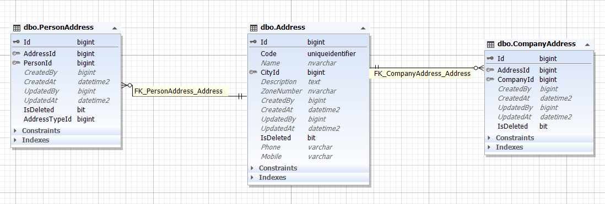

به دلیل این که در قسمت های مختلفی و برای موجودیت های گوناگونی از آدرس استفاده می کنیم پس یک جدول آدرس ایجاد شده تا تمام آدرس ها در آن درج شوند و برای هر کاربری دیگری موجودیت ساخته شده و آیدی جدول آدرس در آن قرار می گیرد.

همچنین این آدرس زیر مجموعه یک شهر میبایست قرار بگیرد.

پیاده سازی CRUD آدرس در زمان فرانید های موجودیت های زیر مجموعه آن اتفاق می افتد.

