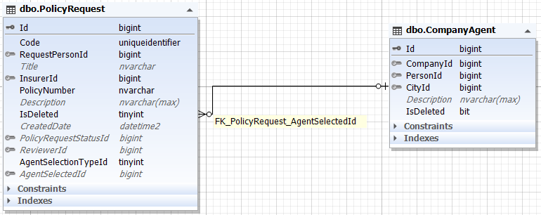

انتخاب نماینده 2 حالت دارد:

1- انتخاب نماینده توسط کاربر که لیستی از نمایندگان هر شهر را می بیند و انتخاب می کند

2- انتخاب مناسب ترین نماینده توسط سیستم که مدیر شرکت آن را انتخاب می کند.

**AgentSelectionTypeId** : نوع نماینده (کاربر انتخاب کرده یا شرکت)

**AgentSelectedId** : آیدی نماینده انتخاب شده

 *برای مطالعه فرایند نماینده [تحلیل  نماینده](./CompanyAgent.md) را مطالعه فرمایید*

  *برای مطالعه پیاده سازی انتخاب نماینده [پیاده سازی انتخاب  نماینده](./AgentSelectionBussiness.md) را مطالعه فرمایید*

