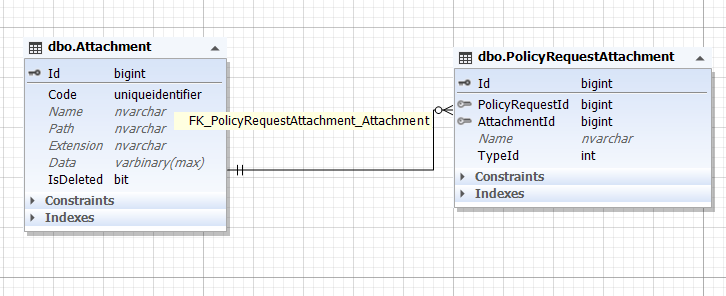

با آپلود هر تصوی، فرانت از طریق آدرس `policy-request/{code}/Attachment` اطلاعات را به سرویس درج فایل در بک میدهد.

آن فاید ابتدا در جدول Attachment ذخیره شده و سپس آیدی آن در جدول PolicyRquestAttachment ذخیره می شود.

**Attachment** : 

Code : کد

Name : نام فایل

Path : آدرس فایل

Extention : فرمت فایل

Data : خود فایل بصورت باینری

 

**PolicyRquestAttachment** : 

PolicyRqeustId : آیدی درخواست بیمه

AttachmentId : آیدی جدول والد

Name : نام فایل

TypeId : نوع فایل

 

*TypeId* : 

اگر بیمه بدنه باشد آنگاه 1 معادل روی کارت یا برگ سبز است و 2 پشت آن

اگر بیمه شخص ثالث باشد 1 روی کارت یا برگ سبز، 2 پشت کارت یا برگ سبز و 3 گواهی نامه رانندگی

