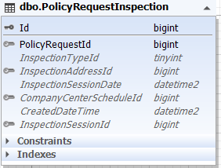
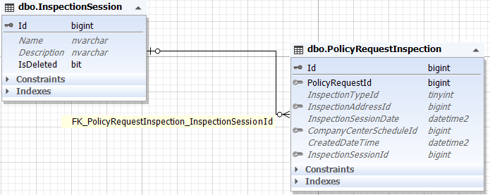
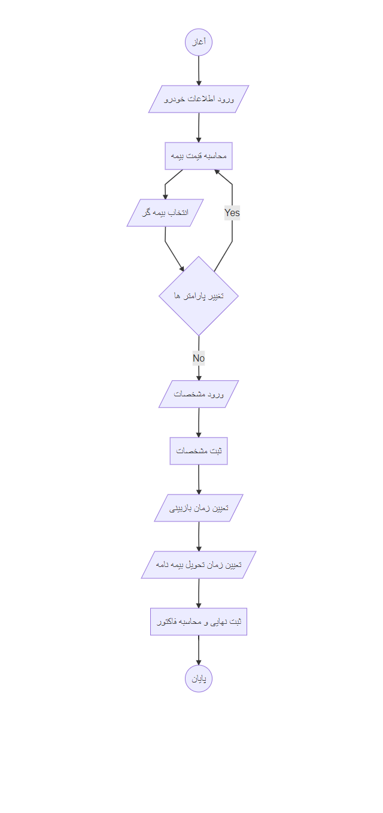

### تحلیل بیمه بدنه

با انتخاب بیمه بدنه ابتدا کاربر مشخصات کلی خودرو را که شامل موارد زیر است انتخاب می کند:

* برند خودرو : این لیستی از اطلاعات جدول VehicleBrand می باشد.

* مدل خودرو: از جدول Vehicle خوانده می شود و تا زمانی که برند را انتخاب نکند مدل ها نمایش داده نمی شوند.
لازم به ذکر است با هر بار که برند انتخاب می شود آیدی آن به سمت سرور ارسال شده تا لیست مدل های آن برند را بیاورد.

بنابر این جدول VehicleBrand رابطه یک به چند با جدول Vehicle دارد.

* کاربری خودرو: از جدول VehicleApplication دریافت می شود.

در مرحله بعدی باید سال ساخت از لیست موجود انتخاب شود.
سپس مرحله بعد باید انتخاب کرد که خودرو قبلا بیمه بدنه داشته یا خیر؟
درصورتی که بیمه بدنه داشته باشد مرحله بعدی باید تاریخ پایان بیمه و شرکت بیمه گر و میزان تخفیف عدم خسارت انتخاب شوند.
در غیر این صورت این مرحله لحاظ نمی شود و مستقیم برای انتخاب نوع خودرو هدایت می شود.

چه خودرو داخلی و چه خارجی انتخاب شود باید مشخص شود که کارکرده است یا صفر کیلومتر. درصورتی که کارکرده باشد مرحله بعدی آن باید میزان تخفیف عدم خسارت ثالث و شرکت بیمه گر ثالث را  انتخاب کند. در غیر این صورت مستقیم به مرحله بعد که وارد کردن ارزش خودرو است میرسد.

پس از آن باید استعلام را بزند تا لیست بیمه گر ها و قیمت آن ها نمایش داده شود.

تمام اطلاعاتی که کاربر تا الان وارد یا انتخاب کرد بصورت کوئری پارامتر سمت سرور ارسال می شود تا بر اساس مقادیر آن و شرایطی که کاربر انتخاب کرده محاسبات را انجام دهد. و در سمت سرور نیز توسط ویومدلی که شامل معادل تمامی این فیلد ها است دریافت می شود.

>*برای مطالعه فرایند محاسبه قیمت بیمه [تحلیل محاسبه قیمت](./Price.md) را مطالعه فرمایید*

با هربار تغییر پارامتر ها، مجددا تمامی پارامتر ها با تغییرات جدید به سمت سرور ارسال می گردند و محاسبه انجام می شود.

در نهایت باید برای ثبت مشخصات اقدام کند.

>*برای مطالعه فرایند ثبت مشخصات [تحلیل ثبت مشخصات](./BodySupplement.md) را مطالعه فرمایید*

بعد از آن کاربر به قسمت بازبینی خودرو هدایت می شود که دو حالت دارد:

1- بازدید در محل

2- بازدید در مراکز

اگر بازدید در محل باشد کاربر باید آدرس خود را وارد کرده و یا از بین آدرس های خود یکی را انتخاب نماید.

اگر در مراکز باشد، کاربر باید مرکز مورد نظر خود را انتخاب نموده و زمان مناسب خود را برای بازدید در مرکز رزرو کند.

بنابر این سیستم بررسی می کند اگر قبلا بازدید را انتخاب کرده بود ویرایش می کند و در غیر این صورت درج میکند.

اطلاعات مربوط به بازبینی خودرو در جدول PolicyRequestInspection قرار گرفته است.

**InspectionTypeId** : نوع بازبینی (در محل / در مرکز)

**InspectionSessionDate** : تاریخ و زمان انتخابی کاربر بطور کامل

**InspectionAddressId** : آدرس محل بازبینی

**InspectionSessionId** : ارتباط به جدول InspectionSession که زمان بندی های بازبینی در آن ذخیره می شوند.

>*برای مطالعه پیاده سازی بازبینی [پیاده سازی بازبینی خودرو](./InspectoinSessionBussiness.md) را مطالعه فرمایید*

 

در مرحله آخر (قبل از فاکتور) نوبت به تعیین زمان تحویل بیمه نامه و محل آن میرسد. تحویل بیمه نامه دو حالت دارد:

1- نسخه الکترونیک که از طریق ایمیل ارسال می گردد

2- نسخه چاپی که ارسال می شود.

 که مجددا کاربر یا آدرس جدیدی وارد می کند یا یکی از آدرس های ثبت شده را انتخاب میکند. و دقیقا مانند بازبینی باید زمان و روز ارسال بیمه نامه را انتخاب نماید.

 این اطلاعات در جدول PolicyRequestIssue نگهداری می شوند که فرزند IssueSession می باشد. موجودیت IssueSession جهت ذخیره سازی زمان های دریافت بیمه نامه است.

 

 **EmailAddress** : آدرس ایمیل

**NeedPrint** : آیا نیاز به نسخه چاپی است

**ReceiverAddressId** : آدرس محل تحویل

**IssueSessionId** : زمان بندی تحویل

**WalletId** : کیف پول

 

فلوچارت این فرایند : 

