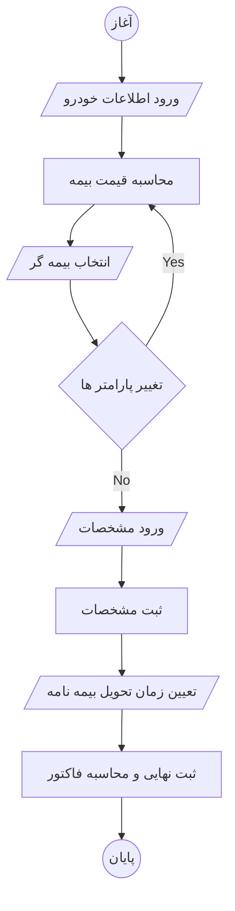

```mermaid
graph TD

S((آغاز)) --> A[/ورود اطلاعات خودرو/]
A--> B[محاسبه قیمت بیمه]
B--> C[/انتخاب بیمه گر/]
C--> D{تغییر پارامتر ها}
D-->|Yes| B
D-->|No| E[/ورود مشخصات/]
E--> F[ثبت مشخصات]
F--> H[/تعیین زمان تحویل بیمه نامه/]
H--> I[ثبت نهایی و محاسبه فاکتور]
I--> J((پایان))

```

