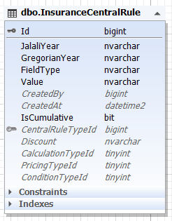
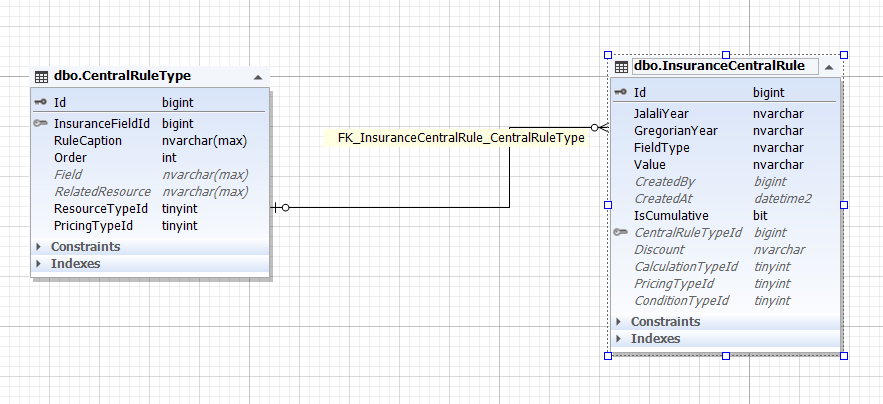

*برای آشنایی با Enumeration  [جدول enum ها](../enumeration/bussiness.md) را مطالعه فرمایید*

**PricingTypeId** : مشخص کننده نوع قیمت گذاری (درصد یا تومان)

مقادیر این ستون در جدول Enumeration نگهداری می شود.

>*برای آشنایی با Enumeration  [جدول enum ها](../enumeration/bussiness.md) را مطالعه فرمایید*

**ConditionTypeId** : مشخص کننده نوع شرط (بزرگتر،کوچکتر و ...)

مقادیر این ستون در جدول Enumeration نگهداری می شود.

>*برای آشنایی با Enumeration  [جدول enum ها](../enumeration/bussiness.md) را مطالعه فرمایید*

**Discount** : مقدار آن فیلد (به دلیل اینکه تحلیل در اواسط کار تغییر کرد نام این فیلد ثابت ماند)

**Value** : مقدار شرطی

مثال: در یک استپ ما قانونی را با توجه به FieldType آن دریافت می شود. حال برای محاسبه تمامی ستون های مذکور لحاظ می شوند. اگر قیمت گذاری درصدی باشد و نوع محاسبه افزایش قیمت، آنگاه به میزان آن درصد از قیمت به مبلق کل افزوده می شود. در این میان شرایط هم درگیر می شود.

همچنین این جدول فرزند جدول CentralRuleType است. موجودیت CentralRuleType انواع قوانین را بصورت کلید نگهداری می کند. این جدول برای این است که انعطاف پذیری را جهت ایجاد هرگونه قوانین با هر شرط را مهیا کنند.

زمانی که اطلاعات این جد.ل سمت فرانت دریافت می شود، از طریق فیلد ResourceTypeId می تواند نوع داده را از جدول Enumeration استخراج کند و   در صورتی که آن داده بصورت مدل باشد آدرس سرویس دریافت آن مدل در فیلد RelatedResource قرار دارد و فرانت می تواند به راحتی آن را فرا بخواند.

سه نوع ResourceType داریم : 

1- Model : از جدولی قرار است اطلاعات دریافت شود. بنابر این آدرس آن در این فیلد قرار میگیرد

2- Enum : اگر اینام باشد از جدول Enumeration با کلیدی که در این فیلد است گرفته می شود.

3- Input : ورودی کاربر

>*جهت مشاهده پیاده سازی قوانین بیمه مرکزی  [پیاده سازی قوانین بیمه مرکزی](./CentralRuleBussiness.md) را مطالعه فرمایید*

