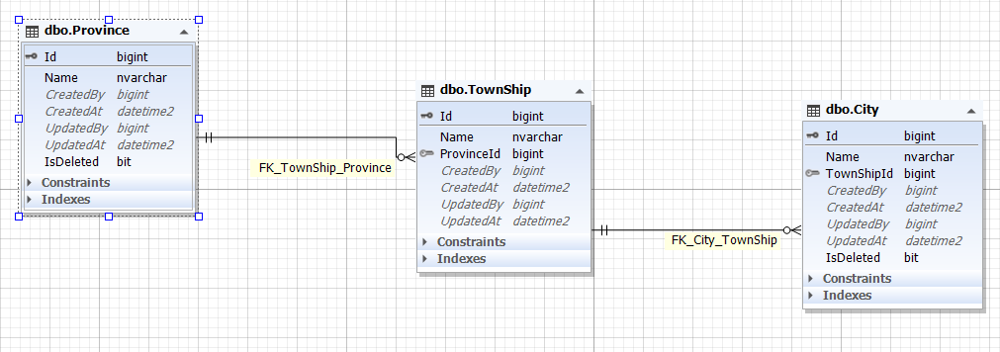

برای استفاده از اطلاعات شهر ها در آدرس یا سایر موجودیت ها ما 3 طبقه برای این کار پیاده کرده ایم.

اولا هر شهری مربوط به یک شهرستان و هر شهرستان هم به یک استان ارتباط پیدا می کند.

بنابر این این سه جدول به ترتیب روابط یک به چند دارند.

پیاده سازی آن ها عملیات پیچیده ای ندارد و مانند سایر عملیات های CRUD انجام می شود.

