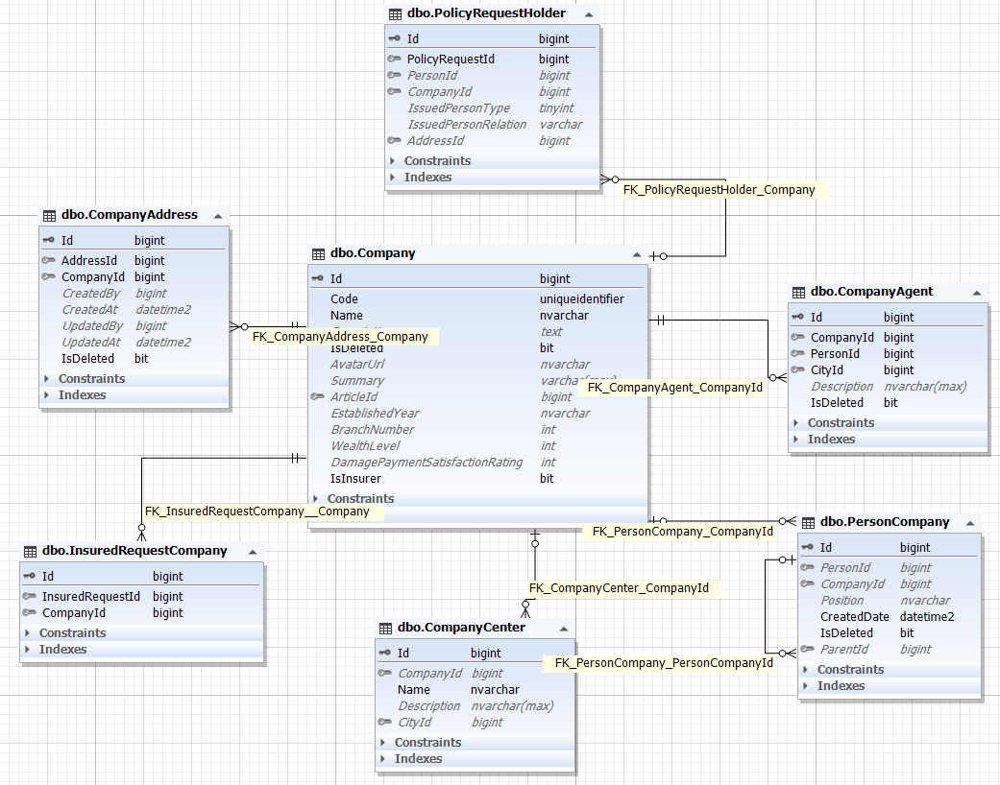

موجودیت Company به معنی شرکت می باشد. بنابر این ما می توانیم هر شرکتی داشته باشیم. این جدول شامل جداول فرزندی است که تکمیل کننده اطلاعات آن می باشند.

شرح فرزندان :

**PolicyRequestHolder** : جدول مربوط به بیمه گذار

>*برای مطالعه درباره بیمه گذار [بیمه گذار](./PolicyRequestHolder.md) را مطالعه فرمایید*

**CompanyAgent** : نمایندگان شرکت

>*برای مطالعه درباره نمایندگان شرکت [نماینده شرکت](./CompanyAgent.md) را مطالعه فرمایید*

**PersonCompany** : افراد شرکت

>*برای مطالعه درباره افراد شرکت [افراد شرکت](./PersonCompany.md) را مطالعه فرمایید*

**CompanyCenter** : مراکز شرکت در شهر های دیگر

>*برای مطالعه درباره مراکز شرکت [مراکز شرکت](./CompanyCenter.md) را مطالعه فرمایید*

**InsuredRequestCompany** : شرکت های بیمه شونده

 >*برای مطالعه تحلیل InsuredRequest [تحلیل بیمه شونده](./InsuredRequest.md) را مطالعه فرمایید*

 **CompanyAddress** : آدرس شرکت

   >*برای مطالعه تحلیل آدرس [تحلیل آدرس](./Address.md) را مطالعه فرمایید*

