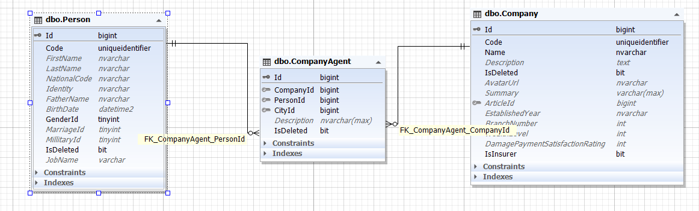

هر شرکت می تواند نماینده ای داشته باشد و این نماینده  یک شخص است. از طرفی یک شخص هم می تواند نمایندگی چند شرکت را در اختیار داشته باشد بنابر این موجودیت شرکت با شخص یک رابطه چند به چند پیدا می کند.

در نتیجه جدول ثالثی با نام CompanyAgent تعریف می شود تا Person و Company را تحت عنوان نماینده شرکت بهم مرتبط کند.

علاوه بر آن این نماینده در شهر های گوناگون می باشد پس باید آیدی شهر هم در این موجودیت قرار بگیرد.

>*برای مطالعه پیاده سازی نماینده [پیاده سازی نماینده شرکت](./AgentCompanyBussiness.md) را مطالعه فرمایید*

