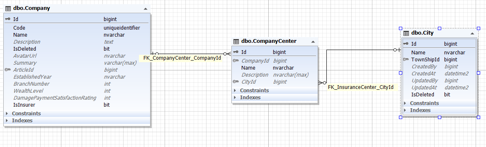
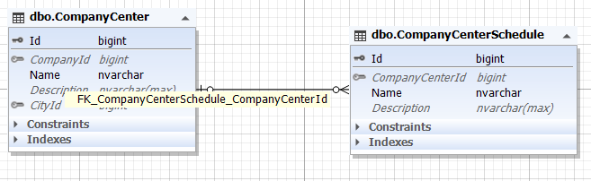

هر شرکت می تواند مراکزی در شهر های مختلف داشته باشد .

جدول CompanyCenter محل نگهداری اطلاعات مراکز است و فرزند موجودیت شرکت محسوب می شود.

>*برای مطالعه درباره شهر ها [تحلیل شهر](./City.md) را مطالعه فرمایید*

>*برای مطالعه پیاده مراکز شرکت [پیاده سازی مراکز](./CompanyCenterBussiness.md) را مطالعه فرمایید*

این مراکز به جهت اینکه در مواقعی لازم است بازبینی حضوری انجام شود پس دارای زمان بندی های متفاوتی برای این امر هستند. ما این زمان بندی ها را در موجودیت CompanyCenterSchdule نگهداری می کنیم.

پیاده سازی آن ها عملیات پیچیده ای ندارد و مانند سایر عملیات های CRUD انجام می شود.

