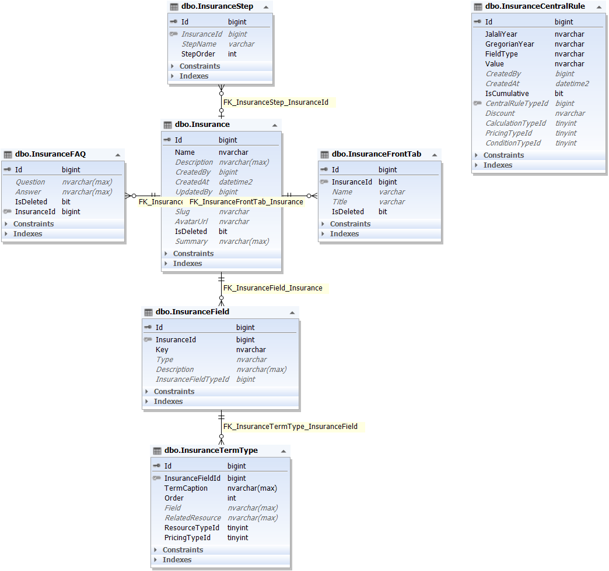

موجودیت Insurance در بر دارنده بیمه ها می باشد. مثلا بیمه آتش سوزی، بده و ...

این موجودیت دارای فرزند هایی نیز می باشد که در زیر به شرح آن ها می پردازیم:

**InsuranceSteps** : استپ های هر بیمه که معادل آن ها کلاس ساخته می شود و برای محاسبه قیمت بیمه گر ها کاربرد دارد

**Insurers** : بیمه گر ها

**InsuranceFields** : فیلد هایی که از آن ها برای محاسبه قیمت ها و تعیین شروط استفاده می شود.

**InsuranceFrontTabs** : در برخی صفحات فرانت از آنجایی که تب ها را باید بر اساس بیمه ها بیاورد، بنابر این باید این تب ها در جایی نگهداری شوند.

**InsuranceFaqs** : پرسش و پاسخ های مربوط به هر بیمه در این جدول قرار دارند

فیلد ها و نوع ارتباط را در عکس زیر مشاهده فرمایید:

