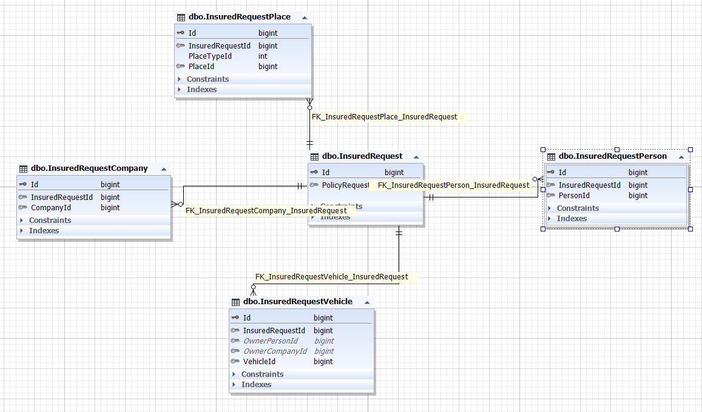
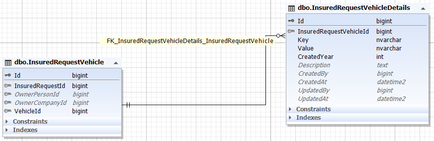

**بیمه شونده** : وقتی شخصی یا چیزی بیمه می شود، آن شخص یا سایر موارد بیمه شونده هستند. یعنی بیمه شده اند.

پس ما در سیستم نیاز به یک موجودیت برای بیمه شونده بودیم و این موجودیت InsuredRequest نام دارد.

برای پیاده سازی بهتر آن، بیمه شوندگان به دسته بندی زیر تقسیم شدند:

1- اشخاص

2- شرکت --> مثل یک شرکت را بیمه می کنند

3- خودرو

4- مکان --> برای مثال یک خانه یا زمین یا ...

و تمام آن ها فرزندان InsuredRequest هستند. بنابر این در فرایند خرید و درخواست بیمه ، نسبت به چیزی که بیمه می شود این جداول درج می شوند.
 
 باید اشاره کرد که خود InsuredRequest نیز طبیعتا باید فرزند policyRequest باشد.

هر کدام از این موجودیت ها نیز نسبت به هدفشان با جداول Person , Vehicle , Company و Place رابطه دارند.

 

از آن جایی که خودرو بیمه شده مشخصاتی نیز دارد که از سمت کاربر می آید پس جدولی به نام InsuredRequestVehicleDetail ساخته شده است.

این جدول بصورت کلید و مقداری می باشد تا بتوان هر نوع خصوصیتی از خودرو را در آن درج نمود.

