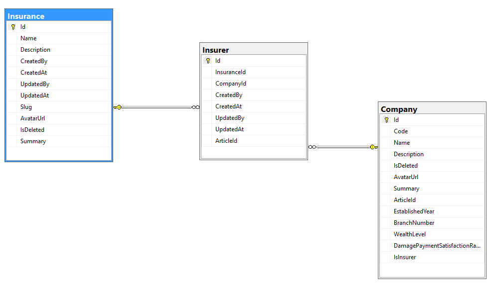

موجودیت Company به معنی شرکت می باشد. بنابر این ما می توانیم هر شرکتی داشته باشیم. از طرفی هم موجودیت Insurance به معنی بیمه میباشد. بنابر این اگر بخواهیم بیمه گر داشته باشیم باید شرکت را با بیمه مرتبط کنیم. از طرفی هم یک شرکت می تواند چندین بیمه را پوشش دهد و همینطور یک بیمه می تواند در چندین شرکت موجود باشد.

در نتیجه ما نیاز به یک موجودیت ثالث به نام بیمه گر داریم که آن را Insurer می نامیم. در واقع Insurer مشخص میکند کدام شرکت چه بیمه هایی را ارائه میدهد و برعکس

شرکت ما + بیمه بدنه = بیمه بدنه ما

شرکت ما + بیمه شخص ثالث = شخص ثالث ما

تصویر زیر فیلد ها و رابطه جداول را شرح می کند:

>*برای مطالعه درباره بیمه ها و اعضای آن [بیمه ها](./Insurance.md) را مطالعه فرمایید*

