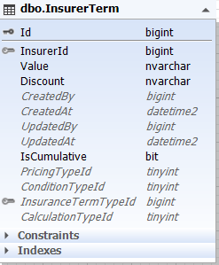
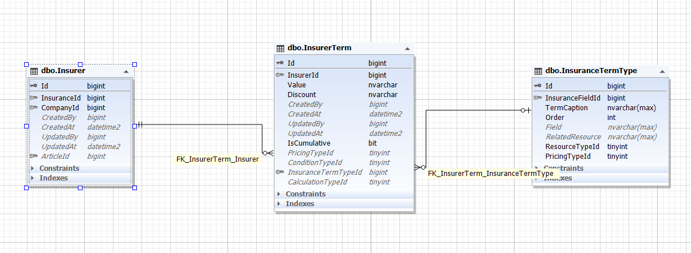
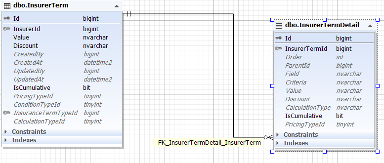

*برای آشنایی با Enumeration  [جدول enum ها](../enumeration/bussiness.md) را مطالعه فرمایید*

**PricingTypeId** : مشخص کننده نوع قیمت گذاری (درصد یا تومان)

مقادیر این ستون در جدول Enumeration نگهداری می شود.

>*برای آشنایی با Enumeration  [جدول enum ها](../enumeration/bussiness.md) را مطالعه فرمایید*

**ConditionTypeId** : مشخص کننده نوع شرط (بزرگتر،کوچکتر و ...)

مقادیر این ستون در جدول Enumeration نگهداری می شود.

>*برای آشنایی با Enumeration  [جدول enum ها](../enumeration/bussiness.md) را مطالعه فرمایید*

**Discount** : مقدار آن فیلد (به دلیل اینکه تحلیل در اواسط کار تغییر کرد نام این فیلد ثابت ماند)

**Value** : مقدار شرطی

مثال: در یک استپ ما قانونی را با توجه به InsuranceTermTypeId آن دریافت می شود. حال برای محاسبه تمامی ستون های مذکور لحاظ می شوند. اگر قیمت گذاری درصدی باشد و نوع محاسبه افزایش قیمت، آنگاه به میزان آن درصد از قیمت به مبلق کل افزوده می شود. در این میان شرایط هم درگیر می شود.

همچنین این جدول فرزند جدول InsuranceTermType است. موجودیت InsuranceTermType انواع قوانین را بصورت کلید نگهداری می کند. این جدول برای این است که انعطاف پذیری را جهت ایجاد هرگونه قوانین با هر شرط را مهیا کنند.

زمانی که اطلاعات این جد.ل سمت فرانت دریافت می شود، از طریق فیلد ResourceTypeId می تواند نوع داده را از جدول Enumeration استخراج کند و   در صورتی که آن داده بصورت مدل باشد آدرس سرویس دریافت آن مدل در فیلد RelatedResource قرار دارد و فرانت می تواند به راحتی آن را فرا بخواند.

>*جهت مشاهده پیاده سازی قوانین بیمه گر  [پیاده سازی قوانین](./InsurerTermBussiness.md) را مطالعه فرمایید*

برخی از قوانین بیمه ممکن است دارای حالات گوناگون باشند یا برای مثال از چند شرط تشکیل شده باشد.

مثال: اعمال تخفیف در صورتی که مشتری هم بیمه ثالث داشته باشد هم بدنه

برای پیاده سازی این مهم، جدولی به نام InsurerTermDetail ساخته شده که جزئیات هر قانون را در آن نگهداری می کنیم

برخی فیلد ها با جدول والد مشترک هستند که همان ویژگی ها را دارند.

اما در این جدول فیلد ParentId در واقع یک رابطه یک به چند به خود این جدول درست می کند. به این دلیل که ممکن است برخی از جزئیات هم شامل شروطی باشند.

>*جهت مشاهده پیاده سازی جزئیات قوانین بیمه گر  [پیاده سازی جزئیات](./InsurerTermDetailBussiness.md) را مطالعه فرمایید*

