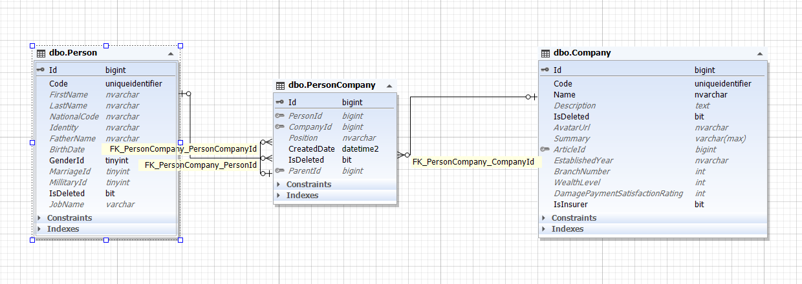

هر شرکت می تواند افرادی داشته باشد و این افراد می توانند نمایندگان، کارشناسان، مدیر شرکت و .. باشند. از طرفی یک شخص هم می تواند در چند شرکت عضویت داشته باشد بنابر این موجودیت شرکت با شخص یک رابطه چند به چند پیدا می کند.

در نتیجه جدول ثالثی با نام PersonCompany تعریف می شود تا Person و Company را تحت عنوان افراد شرکت بهم مرتبط کند.

علاوه بر آن این شخص دارای سمت های گوناگون می باشد پس باید فیلدی به نام Position هم در این موجودیت قرار بگیرد.

همچنین یک فرد در یم شرکت می تواند زیر مجموعه فردی دیگر باشد پس باید این جدول با خودش رابطه یک به چند داشته باشد. بنابر این فیلد ParentId را در آن قرار می دهیم.

>*برای مطالعه پیاده فرد و شرکت [پیاده سازی افراد شرکت](./PersonCompanyBussiness.md) را مطالعه فرمایید*

