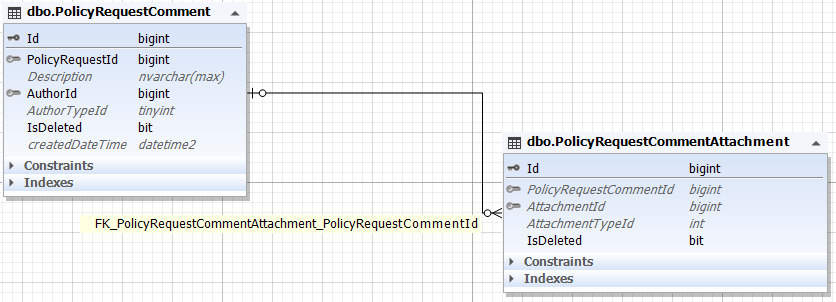

در مواقعی که درخواست بیمه از سمت کاربر دارای نقص باشد و یا مشکلی داشته باشد، کارشناس شرکت آن را در داشبورد خود بررسی می کند و یادداشتی برای آن درخواست میگذارد و این مطلب در پنل کاربر قابل مشاهده خواهد بود تا بتواند رسیدگی کند.

جدول PolicyRequestCommentAttachment هم برای این است که احتمال دارد بخواهند فایل را نیز برای اصلاحیه آپلود کنند.

جدول PolicyRequestComment: 

**Description** : توضیحات 

**AuthorId** : نویسنده اصلاحیه که به جدول Person وصل می شود.

**AuthorTypeId** : نوع نویسنده 

 

جدول PolicyRequestCommentAttachment :

**AttachmentId** : جدول Attachment

**AttachmentTypeId** : نوع فایل

 

> *برای مطالعه پیاده سازی اصلاحیه بیمه [اصلاحیه درخواست بیمه](./PolicyRequestCommentBussiness.md) را مطالعه فرمایید*

