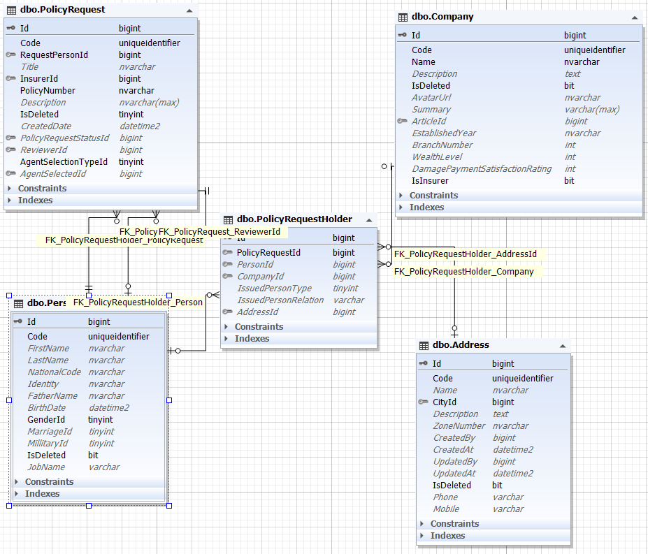

بیمه گذار به معنی کسی است که بیمه را چه برای خود و چه برای دیگری خریداری می کند. موجودیت آن در سیستم با نام PolicyRequestHolder شناخته می شود و یکی از فرزندان PolicyRequest می باشد.

همان طور که مشخص است آیدی تمام والد ها در آن موجود است. اما دو فیلد دیگر :

**IssuedPersonType** : مشخص میکند نوع بیمه شونده مشخص می شود ( خودش یا دیگری)

**IssuedPersonRelation** : درصورتی که دیگری باشد در این فیلد نصبت با شخص بیمه شده قرار می گیرد.

