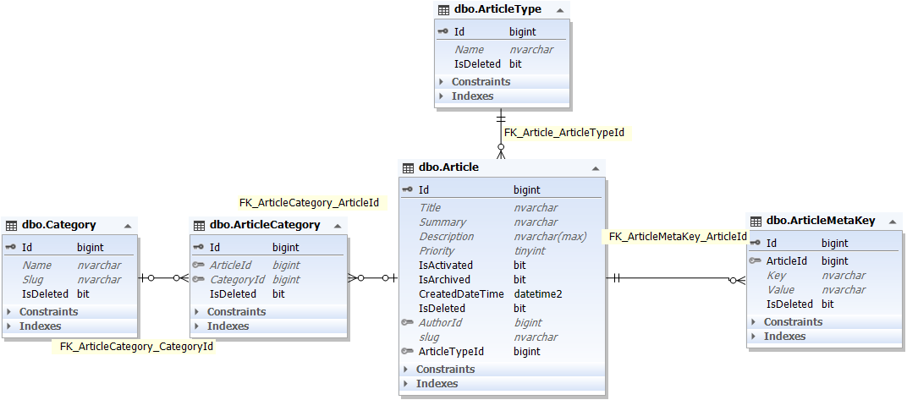

    
    

##### بسمه تعالی

#### سند تحلیل فرایند ثبت درخواست بیمه

#### ویرایش: 04/11/1400 – تدوین: 04/11/1400 – تهیه کننده: سید علی فخری

****

**فهرست**

[تعاریف و اصطلاحات](#_Toc93951617)

[تشریح و تحلیل فرایند ثبت درخواست بیمه](#_Toc93951618)

[ دیاگرام کاربرد (UseCase)](#_Toc93951619)

[ دیاگرام موجودیت  (ERD)](#_Toc93951620)

[ دیاگرام ترتیب  (Sequence)](#_Toc93951621)

****

 
 

> **تعاریف و اصطلاحات**

> *برای مطالعه تعاریف و اصطلاحات [تعاریف](../common/CommonStructure.md) را مطالعه فرمایید*

****

> **تشریح و تحلیل فرایند**

کاربران با ورود به سایت **Allbim.org** وارد صفحه اول و اصلی این اپلیکیشن می شوند که دارای منو و گزینه های مختلفی برای انجام امور است.
در منوی بالای صفحه قسمت **انواع بیمه ها** لیست بیمه ها مشاهده می شود.
کاربران می توانند ابتدا ثبت نام کنند و بعد از ورود ادامه دهند یا طی فرایند انتخاب بیمه این کار را انجام دهند.

> *برای مطالعه فرایند درخواست بیمه بدنه [تحلیل بدنه](./BodyProcess.md) را مطالعه فرمایید*

> *برای مطالعه فرایند درخواست بیمه شخص ثالث [تحلیل ثالث](./ThirdProcess.md) را مطالعه فرمایید*

و نهایتا با تعیین نوع نماینده به مرحله پرداخت میرسیم.

> *برای مطالعه فرایند تعیین نماینده [تحلیل انتخاب نماینده](./AgentSelection.md) را مطالعه فرمایید*

> *برای مطالعه فرایند پرداخت [تحلیل پرداخت](../payment/FactorPaymentProcess.md) را مطالعه فرمایید*

باید اشاره کرد که بعد از طی تمام این مراحل تمام اطلاعات وارد شده در پایگاه داده ثبت می شود و برای نمایش قیمت نهایی در فاکتور مجددا محاسبه قیمت بیمه بر اساس اطلاعات ثبت شده انجام می کردد.

پس از ثبت درخواست بیمه توسط کاربر، اگر در زمان انتخاب نماینده، گزینه خودکار را انتخاب کرده باشد شرکت آن درخواست را به یکی از کارشناسان خود ارجاع می دهد تا بررسی شود و در غیر این صورت نماینده انتخاب شده توسط کاربر بررسی می کند.

پس از بررسی ها کارشناس یا نماینده ایرادات احتمالی آن درخواست را به اطلاع کاربر می رساند و یا جهت صدور آن را ثبت میکند.

> *برای مطالعه فرایند اصلاحیه بیمه [اصلاحیه درخواست بیمه](./PolicyRequestComment.md) را مطالعه فرمایید*

 

**RequestPersonId** : شخص درخواست دهنده --> جدول Person

**Title** : عنوان درخواست بیمه که توسط سیستم با توجه به نام بیمه و بیمه گر ساخته می شود.

**InsurerId** : بیمه گر --> جدول Insurer

**PolicyNumber** : شماره بیمه نامه

**Description** : توضیحات احتمالی

**PolicyRequestStatusId** : وضعیت درخواست بیمه که می تواند در حل صدور، صادر شده و ... باشد --> جدول PolicyRequestStatus

**ReviewerId** : بررسی کننده درخواست کسی --> جدول Person

می تواند یکی از اعضای شرکت این درخواست را بازبینی کند.

**AgentSelectionTypeId** : نوع انتخاب نماینده  

**AgentSelectId** : نماینده انتخاب شده برای این درخواست --> جدول CompanyAgent

 

 

مدیریت سیستم و شرکت نیز می توانند برای هر کاربری درخواست اضافه کنند.
البته شرکت فقط می تواند برای افراد زیر مجموعه خودش این کار را انجام دهد. این عمل در داشبورد ها اتفاق می افتد.

> *برای مطالعه پیاده سازی درخواست بیمه [پیاده سازی درخواست بیمه](./PolicyRequestBussiness.md) را مطالعه فرمایید*

 

****

 **نمودار کاربرد ( use case diagram )**

نمودار کاربرد این فرایند به شکل زیر می باشد:

 

****

**در زیر می توانید دیاگرام موجودیت ها و کلاس های این فرایند را مشاهده نمایید**

 

 

 

 

 

 

 

 

 

 

 

 

 

****

>**نمودار ترتیب (sequence diagram)**

 

