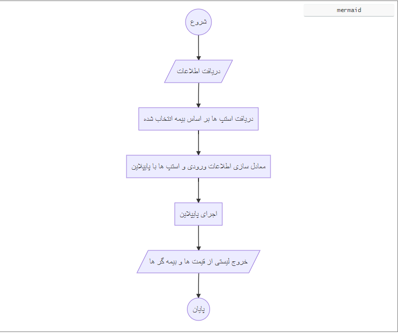

### تحلیل محاسبه قیمت بیمه

فرایند محاسبه قیمت درقالب یک pipeline صورت میپذیرد. چراکه المان های محاسبه قیمت هر کدام تاثیرات گوناگونی بر قیمت گذاری دارند. برای مثال یک المان مانند آتش سوزی می تواند درصدی از قیمت کاسته یا آن را افزایش دهد. و همین روال برای سایر المان ها نیز صادق است.
بنابر این یک چرخه ای طراحی شد تا بصورت انعطاف پذیر هر نوع المانی با هر نوع تاثیر چه کاهش و چه افزایش قیمت را بتوان پیاده سازی کرد.
 
در این pipeline ما این المان ها یا پوشش ها را بصورت step هایی از هر بیمه در نظر گرفتیم و در کلاسی abstract لیستی از این استپ ها قرار دادیم به همراه متدی abstract. از آنجایی که هر پوشش روند محاسبات ی جدا دارد بنابر این معادل هر یک از این استپ ها کلاسی ساخته شده و از کلاس اصلی پایپلاین ارث بری کرده است تا آن بدنه آن متد را متناسب خود پیاده سازی کند.
 
برای ذخیره استپ ها از جدول InsuranceStep که فرزند Insurance می باشد استفاده شده.
 
با اینکه برای هر نوع بیمه استپ های جداگانه وجود دارد اما کافی است فقط ورودی های کاربر و بیمه گر به این کلاس داده شود تا بصورت داینامیک بر اساس فرمول های هر بیمه محاسبات را انجام دهد. این محاسبات به ازای تمام Insurer ها یا همان بیمه گر ها انجام می شود و نهایتا لیستی از بیمه گر ها و قیمت آن ها را خروجی می دهد.
 
لازم به ذکر است که سرویس های هر بیمه بصورت جداگانه طراحی شده.

 

>*برای مطالعه درباره شرکت های بیمه [بیمه گر](./Insurer.md) را مطالعه فرمایید*

>*برای مطالعه درباره بیمه ها و اعضای آن [بیمه ها](./Insurance.md) را مطالعه فرمایید*

>*برای مطالعه شرکت [شرکت ها](./Company.md) را مطالعه فرمایید*

>*برای مشاهده پیاده سازی پایپلاین [Pipe Line](./PipeLine.md) را مطالعه فرمایید*

>*برای مشاهده پیاده سازی محاسبه قیمت بیمه شخص ثالث [محاسبه ثالث](./ThirdPrice.md) را مطالعه فرمایید*

>*برای مشاهده پیاده سازی محاسبه قیمت بیمه بدنه [محاسبه بدنه](./BodyPrice.md) را مطالعه فرمایید*

