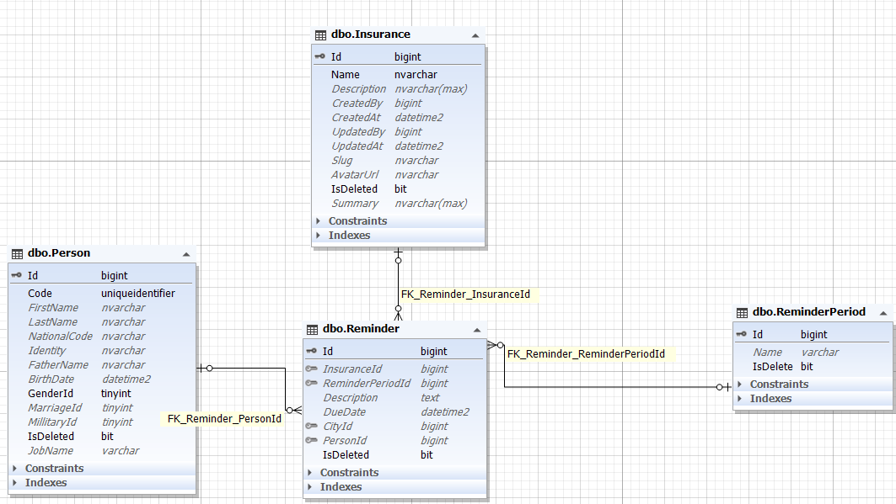

    
    

##### بسمه تعالی

#### سند تحلیل فرایند یادآور

#### ویرایش: 04/11/1400 – تدوین: 04/11/1400 – تهیه کننده: سید علی فخری

****

**فهرست**

[تعاریف و اصطلاحات](#_Toc93951617)

[تشریح و تحلیل فرایند یاد آور](#_Toc93951618)

[ دیاگرام کاربرد (UseCase)](#_Toc93951619)

[ دیاگرام موجودیت  (ERD)](#_Toc93951620)

[ دیاگرام ترتیب  (Sequence)](#_Toc93951621)

****

 
 

> **تعاریف و اصطلاحات**

> *برای مطالعه تعاریف و اصطلاحات [تعاریف](../common/CommonStructure.md) را مطالعه فرمایید*

****

> **تشریح و تحلیل فرایند**

یادآور در واقع سیستمی است که کاربر می تواند زمانی یا ست کند تا در آن زمان از طریق پیامک چیزی را یاد آوری کند.
این یادآور ساخته شده باید به یک دوره یادآوری مرتبط شود و از آنجایی که به شخص مربوط می شود بنابراین به جدول پرسن نیز ارتباط دارد.

 

**Description** : توضیحات و متن یادآور

**DueDate** : تاریخ یاد آوری

**ReminderPeriodId** : دوره یادآوری

 

> *برای مطالعه پیاده سازی یادآور [پیاده سازی](./ReminderBussiness.md) را مطالعه فرمایید*

