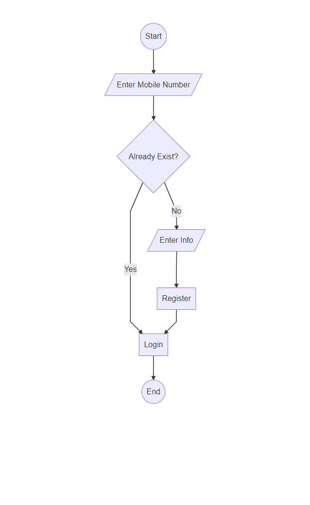

## ثبت نام

***

 

ابتدا کاربر باید شماره موبایل خود را وارد کند. این شماره در سیستم چک می شود که آیا موجود است یا خیر. در صورت موجود بودن به قسمت ورود می رود و در غیر این صورت جهت اعتبار سنجی آن شماره،  پیامکی حاوی کد تایید ثبت نام ارسال می شود.
زمانی که این کد ساخته می شود، به مدت 2 دقیقه اعتبار دارد و پس از آن باطل می شود. این اطلاعات به همراه ip کاربر در جدولی به نام RegisterTemp ذخیره می شود.

این کد باید همراه سایر مشخصات فردی و کاربری مثل نام و کد ملی و نام کاربری و رمز عبور وارد و ثبت شوند. رمز عبور همواره بصورت Hash ذخیره سازی می شود.

با اینکار جداول Person و User بصورت همزمان درج می شوند.

> *برای مطالعه پیاده سازی ثبت نام [پیاده سازی ثبت نام](.RegistrationBussiness.md) را مطالعه فرمایید*

 

