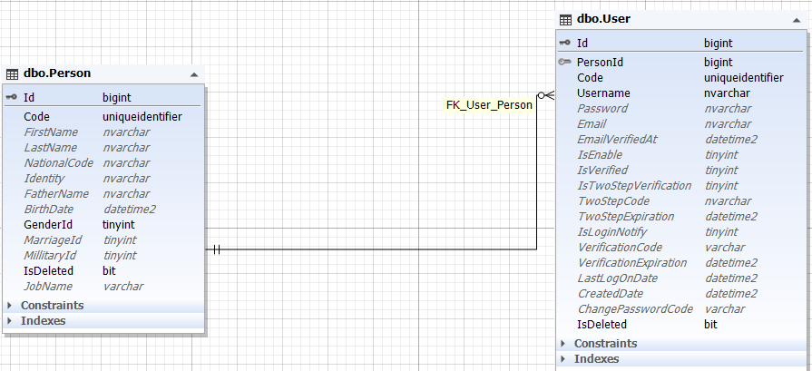
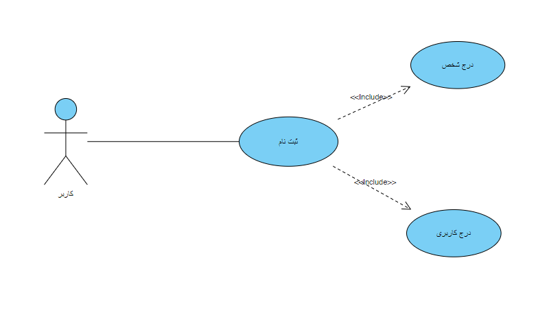
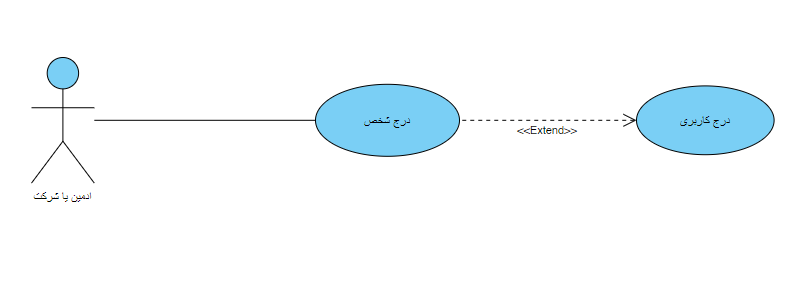
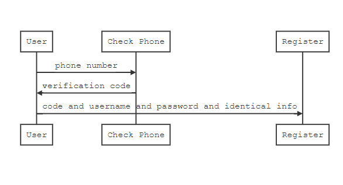
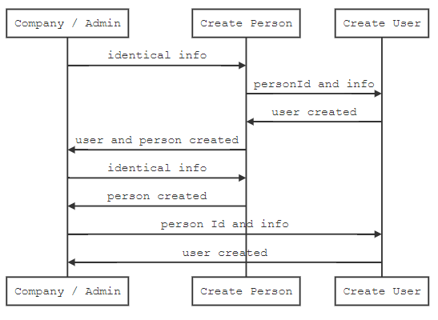

​    

#### بسمه تعالی

### سند تحلیل فرایند فرد و کاربری

### ویرایش: 04/11/1400 – تدوین: 04/11/1400 – تهیه کننده: سید علی فخری

****

### **فهرست**

[تعاریف و اصطلاحات](#_Toc93951617)

[تشریح و تحلیل فرایند شخص و کاربری  ](#_Toc93951618)

[ دیاگرام کاربرد (UseCase)](#_Toc93951619)

[ دیاگرام موجودیت  (ERD)](#_Toc93951620)

[ دیاگرام ترتیب  (Sequence)](#_Toc93951621)

****

 
 

> ## **تعاریف و اصطلاحات**

> *برای مطالعه تعاریف و اصطلاحات [تعاریف](../common/CommonStructure.md) را مطالعه فرمایید*

****

>## **تشریح و تحلیل فرایند**

اصلی ترین عنصر این سیستم کاربران هستند. این کاربران به سه دسته اصلی تقسیم می شوند:

1- کاربران عادی (مشتریان)

2- شرکت

3- مدیریت سیستم (ادمین)

 

در دسته اول ما کاربرانی داریم که از این سامانه بازدید می کنند و هیچ نقشی ندارند بنابر این دسترسی بسیار سطحی و محدودی دارند. اما همین کاربران با ثبت نام در سیستم دارای نقش می شوند که با نام User یا کاربر عادی شناخته می شوند.

مدیریت سیستم فرد یا افرادی هستند که دسترسی کامل به تمام سیستم دارند.

شرکت اما تعریف کلی از اعضای شرکت هستند که شامل مدیر شرکت، نماینده شرکت، کارشناس شرکت و کارشناس نمایندگی می شود.

مهم نیست که نقش هر فرد در سیستم چیست، در هر صورت یک فرد برای کار با سیستم هم اطلاعات هویتی دارد و هم کاربری. 

به این معنی که یک فرد می تواند در سیستم وجود داشته باشد بی آنکه کاربر سیستم باشد، اما برعکس آن صادق نیست.

همچنین یک فرد می تواند چندین حساب کاربری در سیستم داشته باشد. درست مانند واقعیت، که یک انسان، یک هویت فقط یک نفر است و نمی تواند چند هویت داشته باشد.

بنابر این بین فرد و کاربری یک رابطه یک به چند برقرار است. در واقع حساب کاربری فرزند یک شخص است.

ما در این سیستم فرد را با موجودیت Person و موجودیت کاربری را با User تعریف میکنیم. (این user با نقش user اشتباه نشود)

بدین ترتیب به ازای هر شخص می توان جند حساب کاربری داشت اما نمی توان حساب کاربری بدون وجود فردی ایجاد نمود.

 

مطابق تصویر جداول این دو موجودیت مشاهده می شود که اجزای آن به شرح زیر است: 

### **Person** :

**FirstName** : نام

**LastName** : نام خانوادگی

**NationalCode** : کد ملی

**Identity** : شماره شناسنامه یا مدرک هویتی برای اتباع خارجی

**FatherName** : نام پدر

**BirthDate** : تاریخ تولد

**GenderId** : جنسیت --> اگر 0 باشد مرد / 1 باشد زن

**MarriageId** : وضعیت تاهل --> اگر 0 باشد مجرد / 1 باشد متاعل

**MilitaryId** : وضعیت نظام وضیفه --> اگر 0 باشد پایان خدمت / 1 باشد خدمت نرفته

**JobName** : شغل

 

### **User** :

**Username** : نام یا شناسه کاربری

**Password** : رمز عبور

**Email** : آدرس ایمیل

**EmailVerifiedAt** : تاریخ تایید ایمیل

**IsEnable** : آیا فعال است؟

**IsVerified** : آیا تایید شده؟

**IsTwoStepVerification** : آیا تایید دو مرحله ای دارد؟

**TwoStepCode** : کد تایید دو مرحله ای

**TwoStepExpieration** : انقضای کد دو مرحله ای

**IsLoginNotify** : آیا ورود اعلان شود؟ (مثلا از طریق پیامک)

**VerificationCode** : کد تایید

**VerificationExpiration** : انقضای کد تایید

**LastLogOnDate** : تاریخ آخرین ورود

**ChangePasswordCode** : کد تغییر رمز عبود

 

در حال حاضر با اینکه این رابطه یک به چند است اما پیاده سازی به صورتی بوده که بصورت یک به یک استفاده می شود یعنی همیشه FirstOrDefault یوزر را بر می گردانیم. اما یک به چند باقی می ماند برای توسعه در آینده.

زمانی که کاربر ثبت نام می کند در واقع بصورت همزمان فرایند درج برای هر دو جدول اتفاق می افتد

> *برای مطالعه تحلیل ثبت نام کاربر [ثبت نام](./Registration.md) را مطالعه فرمایید*

همچنین کاربر پس از ثبت نام می تواند اطلاعات خود را در پنل ویرایش کند

> *برای مطالعه تحلیل ویرایش اطلاعات کاربر [ویرایش کاربر](./UpdateUserPerson.md) را مطالعه فرمایید*

 

به طور کل قابلیت درج و ویرایش این موجودیت ها در چند قسمت سیستم دیده شده.

یکی دیگر از این قسمت ها زمان درج مشخصات برای درخواست بیمه هست.

> *برای مطالعه تحلیل درخواست بیمه [درخواست بیمه](../policy-request/PolicyRequestProcess.md) را مطالعه فرمایید*

> *برای مطالعه تحلیل درج کاربر در اطلاعات تکمیلی درخواست بیمه [اطلاعات بیمه گذار](../policy-request/PolicyRquestHolder.md) و [اطلاعات بیمه شونده](../policy-request/InsuredRequest.md) مطالعه فرمایید*

>*برای مشاهده پیاده سازی ثبت مشخصات [پیاده سازی مشخصات](../policy-request/SupplementBussiness.md) را مطالعه فرمایید* 

 

در داشبورد نیز ادمین و شرکت می توانند فرد و کاربر درج نمایند.

> *برای مطالعه تحلیل فرایند فرد و کاربر شرکت [فرد و کاربر شرکت](../policy-request/PersonCompany.md) را مطالعه فرمایید*

> *برای مطالعه تحلیل فرایند فرد و کاربر شرکت [نماینده شرکت](../policy-request/CompanyAgent.md) را مطالعه فرمایید*

> *برای مطالعه تحلیل فرایند فرد و کاربر مدیریت سیستم [فرد و کاربر ادمین](.PersonAdmin.md) را مطالعه فرمایید*

 

****

 ## **نمودار کاربرد ( use case diagram )**

نمودار کاربرد فرایند قبت نام به شکل زیر می باشد:

 
 

نمودار کاربرد فرایند قبت شخص و کاربر برای شرکت و ادمین به شکل زیر می باشد:

 

****

**در زیر می توانید دیاگرام موجودیت ها و کلاس های این فرایند را مشاهده نمایید**

 

****

>## **نمودار ترتیب (sequence diagram)**

نمودار ترتیب ثبت نام :

 
 

نمودار ترتیب درج فرد و کاربر شرکت و ادمین

